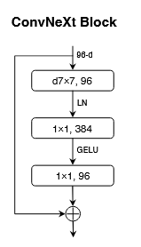
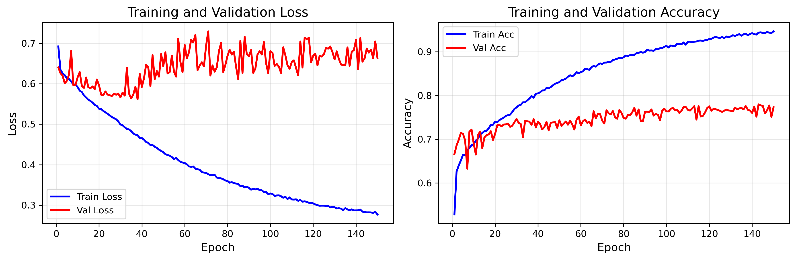
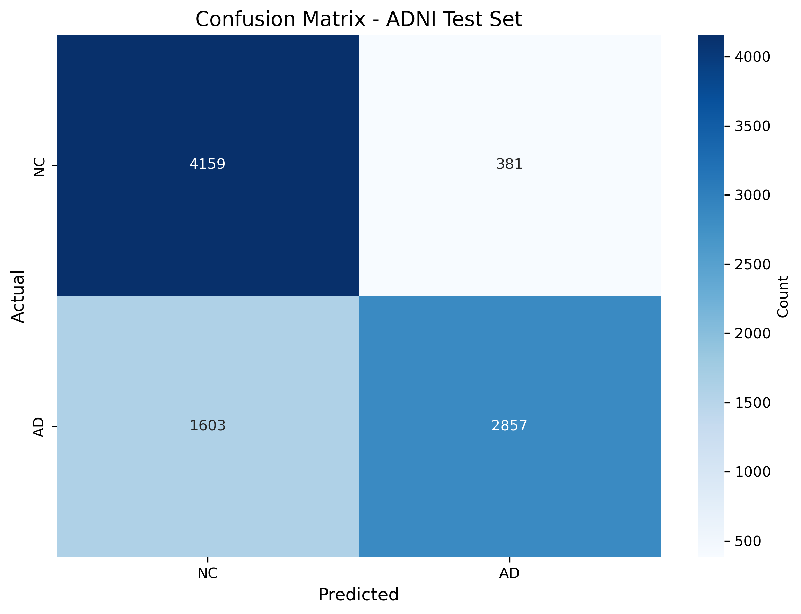

# Alzheimer's Disease Classification using ConvNeXt

# 1. Problem Description
Binary classification of brain MRIs from the ADNI dataset:
- **AD**: Alzheimer's Disease  
- **NC**: Normal Control (Cognitively Normal)
 
**Target accuracy**: ≥ 0.8 on test set
# 1.1 Dataset Overview
This project used the [ADNI dataset fo Alzheimer's Disease](http://adni.loni.usc.edu/). A preprocessed version of the dataset was used.

The dataset is comprised of two classes - AD (Alzheimer's Disease ) and NC (Normal Control).


# 2. Environment Setup
## 2.1 Conda Setup
This project was tested on Miniconda, which can be installed [here](https://docs.anaconda.com/miniconda/miniconda-install/).

Then navigate to the directory of this project within the Conda terminal and execute the following commands:

    conda env create -f environment.yml
    conda activate convnext

## 2.2 Non-Conda Setup

Non-conda is not strictly necessary, if desired.

The required packages that must be installed are:

**Python Packages**
- Python 3.13
- PyTorch 2.7.1
- torchvision 0.22.1
- NumPy 2.1.2
- Pillow 11.0.0
- matplotlib 3.10.6
- seaborn 0.13.2
- scikit-learn 1.7.2
- tqdm 4.67.1

# 3. Model Architecture
ConvNeXt is a modernized CNN architecture that achieves competitive performance with Vision Transformers while maintaining the simplicity and efficiency of convolutional networks. Key features include:
- 7×7 depthwise convolutions for larger receptive fields
- Inverted bottleneck design (expand 4× then compress)
- GELU activation and LayerNorm
- Four-stage hierarchical structure

### ConvNeXtBlock (Building Block)

*ConvNeXt block, retrieved from https://arxiv.org/pdf/2201.03545

The basic building block implements:
- Depthwise 7×7 convolution (groups=dim for channel-wise processing)
- LayerNorm for channel-wise normalization
- Inverted bottleneck MLP (1× → 4× → 1×)
- GELU activation (smoother than ReLU)
- Dropout regularization (0.2) to reduce overfitting
- Residual connection (skip connection for gradient flow)

Each block processes features with large receptive field and efficient channel mixing.

### Full Model Architecture
Complete ConvNeXt-Tiny implementation:
- **Stem layer**: 4×4 conv stride 4 (224×224 → 56×56, 96 channels)
- **Stage 1**: 3 ConvNeXtBlocks at 96 dims (56×56)
- **Downsampling 1**: 2×2 conv stride 2 (56×56 → 28×28, 96→192 channels)
- **Stage 2**: 3 ConvNeXtBlocks at 192 dims (28×28)
- **Downsampling 2**: 2×2 conv stride 2 (28×28 → 14×14, 192→384 channels)
- **Stage 3**: 9 ConvNeXtBlocks at 384 dims (14×14)
- **Downsampling 3**: 2×2 conv stride 2 (14×14 → 7×7, 384→768 channels)
- **Stage 4**: 3 ConvNeXtBlocks at 768 dims (7×7)
- **Classification head**: Global average pooling → LayerNorm → Linear (768 → 2 classes)

Total: 18 ConvNeXtBlocks across 4 stages

## Training
**Hyperparameters**:
- Batch size: 32
- Learning rate: 5e-5
- Epochs: 150 (with early stopping)
- Optimizer: AdamW with weight decay 0.05
- Loss function: CrossEntropyLoss with label smoothing (0.1) and class weights [1.0, 1.5]
- Dropout: 0.2 in ConvNeXt blocks
- Early stopping: Patience of 15 epochs

**Training process**:
- Trains for up to 150 epochs with validation after each epoch
- Generates training curves (loss and accuracy plots)
- Final evaluation on test set with confusion matrix

# 4. Results
Run ```python train.py``` to train and validate.
### Training and Validation History


Both training loss and accuracy show stable trends over time. Training loss decreases gradually over time as accuracy increases. Validation shows much more unstable trends. Despite this, validation accuracy still shows a noticeable increase over time.

This model shows strong accuracy when labelling images of the NC class. However, it struggles with False Negatives when trying to identify images relating to the AD class. This is quite concerning because this would have the most severe impact in real-life applications.

| Class | Precision | Recall | F1-Score | Support |
|-------|-----------|--------|----------|---------|
| NC    | 0.7218    | 0.9161 | 0.8074   | 4540    |
| AD    | 0.8823    | 0.6406 | 0.7423   | 4460    |
| **Accuracy** | | | **0.7796** | **9000** |

The modle achieves an accuract of 0.7796, which is not bad but could be better.

# 5. References
Z. Liu, H. Mao, C.-Y. Wu, C. Feichtenhofer, T. Darrell, and S. Xie, “A ConvNet for the 2020s,”
arXiv:2201.03545 [cs], Mar. 2022, arXiv: 2201.03545. [Online]. Available: http://arxiv.org/abs/2201.03545